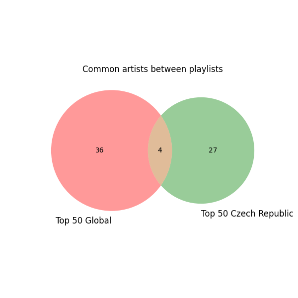
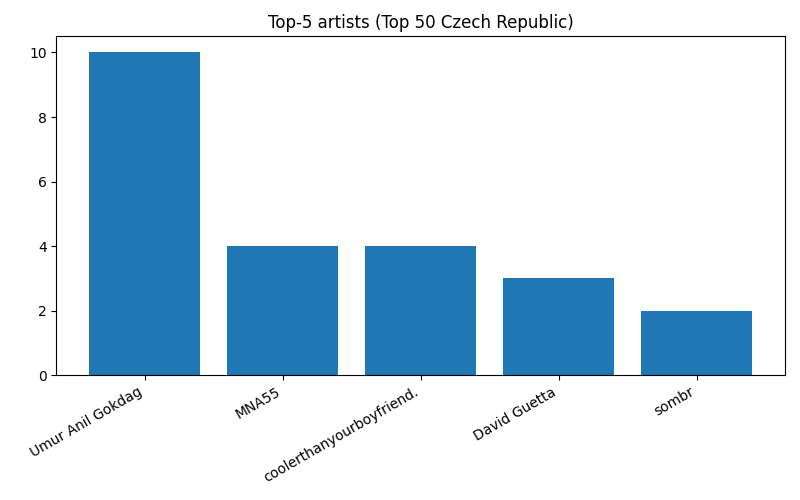
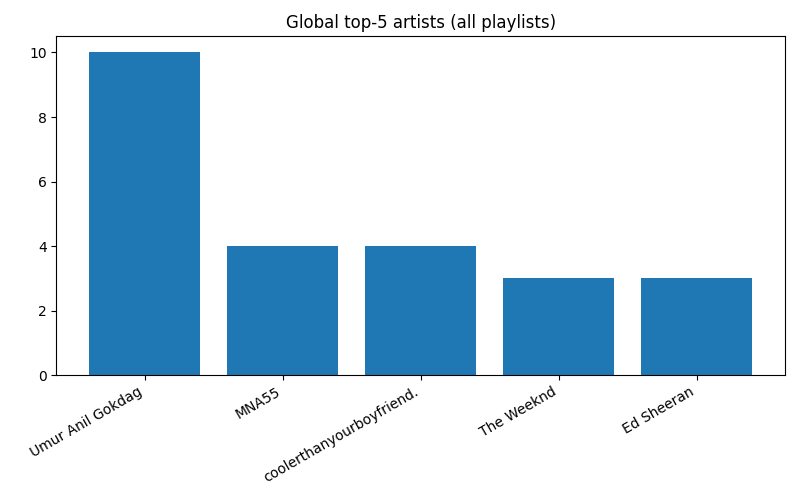

# 🎧 Spotify Data Analysis

A mini data-analysis project exploring audio features of songs.
Using Pandas for data processing and Matplotlib for visualizations.

## Project Overview

This project analyzes a dataset of Spotify tracks and provides insights into:

	- Most popular songs

	- Artists with the highest average popularity

	- Loudest and most energetic tracks

	- Ranking songs based on multiple musical features

	- Visual comparison of top songs using bar charts

The goal was to practice data cleaning, data manipulation, and basic visualization using real-world data.

## Features Implemented

The project loads and processes a Spotify dataset using pandas, where the data is cleaned, filtered, and prepared for analysis. From the full dataset, only meaningful musical attributes—such as loudness, speechiness, and acousticness—were selected. Irrelevant columns were removed, and the remaining tracks were sorted by popularity to simplify further evaluation.

The analysis includes extracting the top 10 most popular tracks, identifying artists with the highest average popularity, and finding songs that stand out based on specific characteristics, such as the loudest track, the most energetic one, and the one with the highest valence (happiness score).

A combined musical score was calculated for each track, where all features were first normalized to ensure fair comparison across different scales. This score helps determine the “best” tracks based on overall musical attributes rather than popularity alone.

The project also includes a simple data visualization: a bar chart created with Matplotlib, comparing loudness levels among top artists, providing an intuitive graphical summary of the dataset.

## Structure
data_cleaning.py     # Removing columns, sorting, preprocessing

feature_stats.py     # Max loudness/energy/valence, top tracks

scoring.py           # Combined normalized feature score

visualization.py     # Matplotlib chart


## How to Run the Project

1) Сlone the repository

```
git clone https://github.com/luzananna/spotify-analysis.git

cd spotify-analysis
```

2) Create a virtual environment
```
python3 -m venv venv

source venv/bin/activate
```

3) Install dependencies
```
pip install -r requirements.txt
```

4) Run analysis scripts
```
python3 src/data_cleaning.py

python3 src/feature_stats.py

python3 src/scoring.py

python3 src/visualization.py
```

## Example Output
```
Common artists: ['Billie Eilish', 'Lady Gaga', 'Taylor Swift', 'Hozier']

Top-5 artists (Top 50 Global):
  The Weeknd: 3 tracks
  Ed Sheeran: 3 tracks
  Post Malone: 3 tracks
  Harry Styles: 2 tracks
  Billie Eilish: 2 tracks

Top-5 artists (Top 50 Czech Republic):
  Umur Anil Gokdag: 10 tracks
  MNA55: 4 tracks
  coolerthanyourboyfriend.: 4 tracks
  David Guetta: 3 tracks
  sombr: 2 tracks

Global Top-5 artists (all playlists combined):
  Umur Anil Gokdag: 10 tracks
  MNA55: 4 tracks
  coolerthanyourboyfriend.: 4 tracks
  The Weeknd: 3 tracks
  Ed Sheeran: 3 tracks
  ```

## Example bar chart (saved as PNG):





